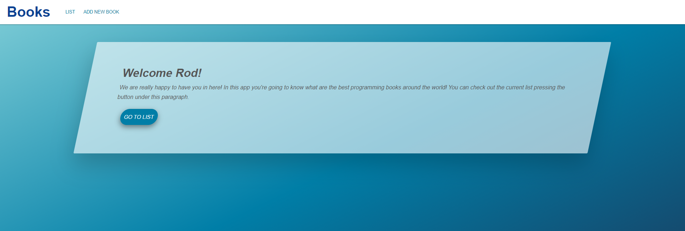

<!-- PROJECT NAME -->

# Books

Web app to store and manage the best programmer books dedicated to software development. Mastering Spring Boot!

<!-- TABLE OF CONTENTS -->

## Table of Contents

- [About the Project](#about-the-project)
  - [Project Structure](#project-structure)
    - [Maven](#maven)
    - [MVC Pattern](#mvc-pattern)
  - [Spring Boot](#spring-boot)
    - [Spring Web](#Spring-web)
    - [H2 Console](#H2-console)
    - [Thymeleaf](#thymeleaf)
    - [Spring Security](#spring-security)
    - [Spring Devtools](#spring-devtools)
    - [Others](#others)
- [Getting Started](#getting-started)
  - [Prerequisites](#prerequisites)
  - [Installing](#installing)
- [Usage](#usage)
- [Built With](#built-with)
- [Authors](#authors)
- [License](#license)
- [Contact](#contact)
- [Acknowlegments](#acknowledgements)

## About the Project



Books is a web application developed by Guillem Martí. This code was developed to learn the basics and advanced techniques used nowadays to develop modern java web applications. Besides, this app will be focused to learn the new features in Spring framework 5 and Spring Boot 2.

To accomplish with the purposes of this project, We need to use Spring Boot with a few dependencies to help me to _boot_ fast and smooth the project.

**Notes**

> This project is a simple snippe of code in the current version. It will grow in the upcoming updates.

Showing up next, we are going to describe the most important parts of this project, the project structure using Apache Maven and the Spring Boot dependendencies that we will store inside the Maven's _pom.xml_.

### Project Structure

The project has been developed using _Apache Maven_, one of the best Java project managers in the Java community. At first glance, it has a classic java folder distribution inside the _src_ folder:

- **main**: this is the main root of the project.
  - **java**: inside this folder is the java project. We will discuss this part later.
  - **resources**: it contains a lot of useful and important files that are important to run correctly the web app.
    - **static**: it stores the CSS file and the images used in the application.
    - **templates**: it has all the HTML files used to Thymeleaf to render the view of the web app.
    - _application.properties_: this files is really important to setup our project. It contains one of the most important configs of this application.
    - _data.sql_: this file contains a raw SQL data to store values of a table inside the H2 Database.
- **test**: it contains all the unit test and mocks to test the correct function of the project.
- _pom.xml_: the POM or project object model is the fundamental unit of work in Maven. We are going to put inside all the dependencies we need to built our project.

In terms of development, is really important taking care of the folder hierarchy, how to order the elements and to understand the importance of every kind of file in it. It is true that, when we built a Spring Boot project using _Spring initializr_, the maven project is already build, but if we know all of these files, we will improve the workflow a lot!

### MVC Pattern

In this project, we used the MVC design pattern, which is commonly used for developing user interfaces that divides the program logic into three interconnected elements: _the model_, _the view_ and _the controller_. Let's take a brief look to this:

- **Model**: the central component of the pattern. It is the data structure of the app and is totally independet of the user interface. The model is responsible for managing the data of the application. It receives user input from the controller.
- **View**: any visual representation counts, but mainly, is the HTML code of the web app. The view means presentation of the model in a particular format.
- **Controller**: accepts input and converts it to commands of model or view. The controller responds to the user input, optionally validates it and performs interactions on the data model objects.

### Spring Boot

What is Spring Boot? Spring Boot is an open source Java framework used to create microservices, developed by Pivotal Team. Is a really powerful tool to build standalone and production ready Spring applications. There is no need to configure Spring, just run your app with the minimun configurations ready to deploy the entire project. The magic of Spring Boot is a real time saver!

Then, we are going to show the main Spring Boot dependencies we have used to build the current project: _Spring Web_, _Spring Data JPA_, _Spring Security_, _Spring Devtools_, _H2 Database_ and _Thymeleaf_. All of this dependencies, called _Spring Boot starters_, will be explained up next.

#### Spring Web

This is the most fundamental dependency to build this project. It uses Apache Tomcat as a default embedded container, giving the possibility to serve the web app into a local web address (by default is localhost:8080). Spring web provide us to use RESTful and Spring MVC. This is crucial to show our templates running in the server side.

This is how it looks in the _pom.xml_.

```xml
<dependency>
  <groupId>org.springframework.boot</groupId>
  <artifactId>spring-boot-starter-web</artifactId>
</dependency>
```

#### Spring Data JPA

Persist data in SQL stores with Java Persistence API using Spring Data and Hibernate. This is how it looks in the _pom.xml_.

```xml
<dependency>
  <groupId>org.springframework.boot</groupId>
  <artifactId>spring-boot-starter-data-jpa</artifactId>
</dependency>
```

#### H2 Console

Provides a fast in-memory database that supports JDBC API and R2DBC access with a small footprint. Supports embedded and server modes as well as a browser based console application (_localhost:8080/h2-console_ by default). This is an interesting solution, because we don't need to use an external relational database. It is more fast to use a runtime database for our main purpose, to learn Spring framework in a development environment. This is how it looks in the _pom.xml_.

```xml
<dependency>
  <groupId>com.h2database</groupId>
  <artifactId>h2</artifactId>
  <scope>runtime</scope>
</dependency>
```

#### Thymeleaf

A modern server-side Java template engine for both web and standalone environments. Allows HTML to be correctly displayed in browsers and as static prototypes. This is how it looks in the _pom.xml_.

```xml
<dependency>
  <groupId>org.springframework.boot</groupId>
  <artifactId>spring-boot-starter-thymeleaf</artifactId>
</dependency>
```

#### Spring Security

Highly customizable authentication and access-control framework for Spring applications. This is how it looks in the _pom.xml_.

```xml
<dependency>
  <groupId>org.springframework.boot</groupId>
  <artifactId>spring-boot-starter-security</artifactId>
</dependency>
```

#### Spring Devtools

Provides fast application restarts. LiveReload and configurations for enhanced development experience. This is how it looks in the _pom.xml_.

```xml
<dependency>
  <groupId>org.springframework.boot</groupId>
  <artifactId>spring-boot-devtools</artifactId>
  <scope>runtime</scope>
  <optional>true</optional>
</dependency>
```

#### Others

- **Lombok**: java annotation library wich helps tp reduce boilerplate code.
- **JUnit**: unit testing framework for a Java applications.
- _And more!_

<!-- GETTING STARTED -->

## Getting Started

To setting up the project locally you can download a copy of this project clicking on the _Clone or download_ and then _Download ZIP_, or you can follow these simple example steps to get a copy of **Books** on your repository.

### Prerequisites

First things first, you need to install Apache Maven and the JDK:

1. Go to [Maven's webpage](https://maven.apache.org/download.cgi), download it and install it into your computer.

2. Next step is to install a Java Development Kit (JDK) to your own computer. You can download it for free from [Oracle's webpage](https://www.oracle.com/es/java/technologies/), but I personally use the [Amazon Corretto's 11](https://aws.amazon.es/corretto/).

### Installing

3. Clone the repository:

```
$ git clone https://github.com/guimarbe/books.git
```

4. Import all the maven dependencies to your project. Here's a screenshot from IntelliJ to show how to reload the maven dependencies and import it to your project.


5. Once you have imported the maven dependencies, make sure to install it into your local artifact:

```
$ mvn clean install
```

6. You can run the app typing:

```
$ mvn spring-boot:run
```

**Note**

> Make sure to run the project using the last instruction, because Devtools will work correctly only with it!

7. That's it! **Books** is running succesfully :smile:

8. To enter inside the application, make sure to enter _admin_ as an username and password.

<!-- USAGE -->

## Usage

Feel free to use this code (see more on [license](#license)).

- Watch and interact with the different elements along the webpage.
- Try the H2 console and try to persist or erase some data.
- Look inside the Java project to understand what is going on.

## Built with

- Apache Maven
- Java 11
- Spring 5
- Spring Boot 2

<!-- CONTRIBUTING -->

## Contributing

Contributions are what make the open source community such an amazing place to learn, inspire and create. Any contributions you make are **greatly appreciated**.

1. Fork the project.
2. Create your Feature Branch: `git checkout -b feature/example-name`.
3. Commit your changes: `git commit -m 'Add some features'`.
4. Push to the Branch: `git push origin feature/example-name`.
5. Open a Pull Request.

<!-- AUTHORS -->

## Authors

- **Guillem Martí**: Code, built and documentation.

<!-- LICENCE -->

## License

The license of this project is a MIT License.

<!-- CONTACT -->

## Contact

Guillem Martí - [@guimarbe](https://twitter.com/guimarbe)

<!-- ACKNOWLEDGEMENTS -->

## Acknowledgements

- [Apache Maven](https://maven.apache.org/)
- [IntelliJ IDEA](https://www.jetbrains.com/es-es/idea/) - My preferred Java IDE
- [Linear Icons](https://linearicons.com/)
- [Spring initializr](https://start.spring.io/)
- [Visual Studio Code](https://code.visualstudio.com/)
